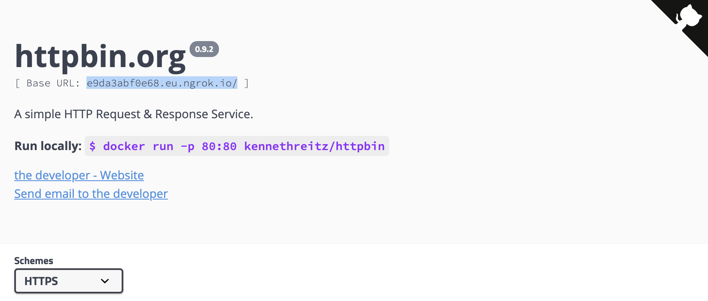
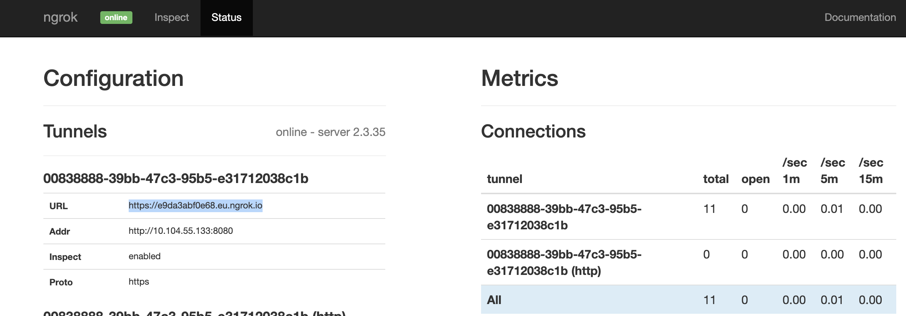

# ngrok-controller, a Kubernetes Service Controller 

Expose services in local [kind](https://github.com/kubernetes-sigs/kind/), [minikube](https://github.com/kubernetes/minikube), or actually any Kubernetes cluster you got running on your laptop via public endpoints provided by [ngrok](https://ngrok.com). The ngrok-controller facilitates as LoadBalancer service.

This project has been written in [Typescript](https://www.typescriptlang.org/) and uses the [dot-i/k8s-operator](https://github.com/dot-i/k8s-operator-node), [kubernetes/client-node](https://github.com/kubernetes-client/javascript), and [ngrok](https://github.com/bubenshchykov/ngrok) modules.

## Quick Walkthrough

Checkout the project:
```bash
$ git clone https://github.com/vasu1124/ngrok-controller.git
$ cd ngrok-controller
```

And deploy using [skaffold](https://skaffold.dev/):
```bash
$ skaffold run --tail
```
(if you wanted to debug, edit, and test the code in the cluster, you would run `skaffold dev`)

You can also use [tilt](https://tilt.dev/), which is configured for debug, edit, and test mode:
```bash
$ tilt up
Tilt started on http://localhost:10350/
v0.30.7, built

(space) to open the browser
(s) to stream logs (--stream=true)
(t) to open legacy terminal mode (--legacy=true)
(ctrl-c) to exit
```

With `tilt up`, you should see output similar as above. Follow the instructions for `tilt`.

If you don't have a service to expose at hand use [httbin](https://httpbin.org), a kustomize template is provided (and is deployed in debug mode anyhow):
```bash
kubectl apply -k kubernetes/httpbin
```

Now patch the service resource with `type: LoadBalancer` and notice that the tunnel is created:
```bash
$ kubectl -n test patch service httpbin -p '{"spec":{"type":"LoadBalancer"}}'
service/httpbin patched

$ kubectl -n test describe service httpbin
Name:                     httpbin
Namespace:                test
Labels:                   app=httpbin
Annotations:              vasu1124/ngrok: http2
...
LoadBalancer Ingress:     e9da3abf0e68.eu.ngrok.io
...
Events:
  Type    Reason  Age    From                Message
  ----    ------  ----   ----                -------
  Normal  Type    2m59s  service-controller  LoadBalancer -> NodePort
  Normal  Type    49s    service-controller  NodePort -> LoadBalancer

$ kubectl -n ngrok-controller logs ngrok-controller-6c596bc8fd-4pgsk
[INFO] ngrok - { version: '0.0.1', log: 'info', interval: '60000' }
[INFO] ngrok - watching resource services.v1
[WARN] ngrok - connected
[INFO] ngrok - Ngroked: httpbin.test/10.104.55.133:8080 connected to https://e9da3abf0e68.eu.ngrok.io
[INFO] ngrok - Service status patched: httpbin.test

$ open https://e9da3abf0e68.eu.ngrok.io
```
In the above example you can now reach your local service endpoint via `https://e9da3abf0e68.eu.ngrok.io`: 

The ngrok tunnel is established by spawning a process (ngrok binary) within the controller pod, which also exposes a monitor UI. You can access this UI easily with a port-forward:
```bash
$ kubectl -n ngrok-controller port-forward service/ngrok-monitor 4040
Forwarding from 127.0.0.1:4040 -> 4040
Forwarding from [::1]:4040 -> 4040

$ open http://localhost:4040/status
```


Debugging in vscode is also possible, use the provided `Attach to dev:start` launch option in the `Run and Debug` section.
